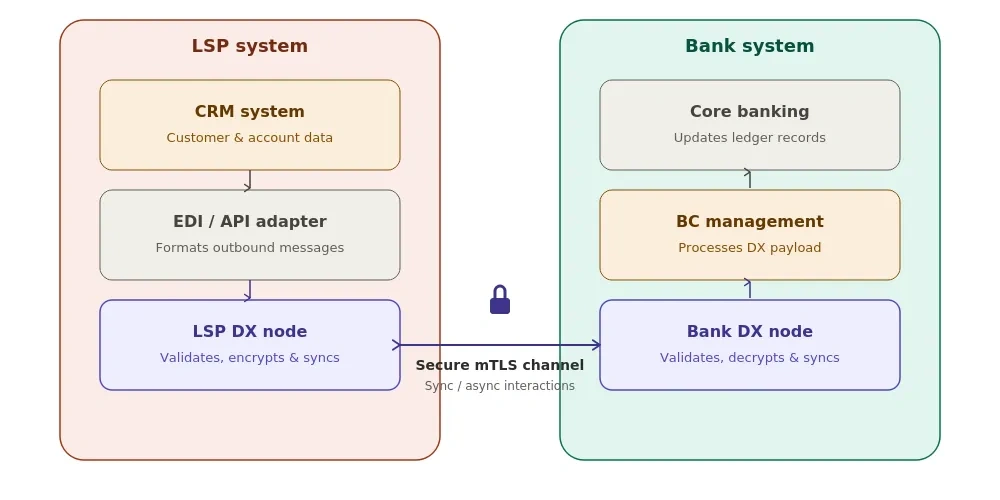

# Securing the LSP-Lender Data Exchange

A loan application can start anywhere: a tablet in a village shop, a loan comparison website, or a checkout screen on an app. But the moment that data needs to reach the lender, everything gets messy. It quickly turns into emailed spreadsheets, SFTP folders, and custom API links that only one or two engineers actually understand.

That is the data plumbing problem. It quietly makes loans slower, riskier, and far more expensive than they need to be.

The pressure is building on everyone. Loan distribution partners are building internal gateways so they can route applications to multiple lenders from a single place. But a gateway without clear data-sharing rules is just chaos. Meanwhile, banks and lenders face the same headache on the other side. Every time a new partner joins, the bank has to build a fresh custom connection from scratch for KYC, eligibility checks, and loan payouts.

TSI DX Node fixes both sides at once. It is a free, open-source tool that lets two companies share data directly and safely, with no middleman. Each side runs its own copy. The lender sets clear rules upfront for what it will accept, sensitive customer details are automatically masked along the way, and both sides keep an unchangeable record of every exchange. It handles big batch files overnight just as easily as quick, instant checks, all under the same clean set of rules.

---

## The Setup: Two Nodes, One Clean Data Highway

The LSP runs a single DX Node. It aggregates origination and servicing data from three upstream channels - assisted onboarding in the field, branch walk-ins, and online marketplace leads - and exchanges all of it with the lender through one governed pipeline. The Bank runs its own DX Node. It defines the contracts: the schemas, the PII rules, and who is permitted to send.

This also scales in both directions. The same LSP node that shares data with one bank can connect to every lender it works with. Each lender is added as a separate partner, each relationship runs on its own rules, and everything flows through the single node that the LSP owns and controls. It works the same way for banks. The one node a bank uses to receive data from one LSP can take on every other LSP too, with no new servers and no new setup each time, just a quick handshake and an agreement. Each institution needs only one node, and that's the whole setup. This is what makes TSI DX Node a practical foundation for an LSP to reach many lenders and an easy, standard way for a bank to bring new LSPs on board.

---

## Origination: Stage by Stage

### Lead

The LSP aggregates leads from three sources: the mobile app in the field, a branch officer entering a walk-in customer, and an online marketplace API that delivers pre-qualified prospects. All three feed into the LSP's internal systems, which push records to the LSP's DX Node via its Client API.

The Bank's node has already published a Lead Intake Contract - a JSON schema specifying exactly which fields are required (name, mobile, location, product interest), with L1 structural validation rejecting malformed records before they ever reach the Bank's systems, and L2 masking on the mobile number in transit. Regardless of which channel the lead came from, it arrives at the Bank clean, schema-valid, and PII-compliant. No email. No FTP. No bespoke endpoint.

### Application

A full loan application contains sensitive PII: Aadhaar-linked identity, proof-of-income references, employer data, and address history. Two things happen simultaneously under the contract engine:

L1 validation rejects any record that is missing a mandatory field or violates a format constraint. The Bank's data quality standards are enforced at the LSP's node, not discovered later during Bank-side processing.

L2 anonymisation hashes or masks fields that the Bank's Data Contract flags as sensitive. Mobile numbers become HMAC tokens, and PAN values are masked. The data travelling between two independent legal entities is already in its compliance posture before it lands.

The Bank's compliance officer can open the Contract Inspector and see, field by field, exactly what governance applies. There is nothing to audit after the fact; the governance is in the contract itself.

Banks can also expose their real-time KYC Validation APIs through the same node, allowing the LSP to verify identity directly as part of the application flow rather than running it as a separate, disconnected check.

### Underwriting

Underwriting leans on that same real-time lane, just for different calls. A credit decision cannot wait for a nightly batch file.

The LSP's system raises a Sync Contract call - an eligibility check, a bureau pull trigger, a risk score request - and receives a governed response within a configurable timeout window. Same mTLS security, same L1/L2 governance, same immutable audit log.

In practice, this means the LSP's loan officer can run a soft eligibility check in the field, whether the customer walked in through a BC, a branch, or a marketplace, without waiting for a batch window, without that check riding an ungoverned REST call, and with full auditability on both ends.

### Loan Booking

Once the credit decision is made, the Bank pushes the sanctioned loan parameters back to the LSP: loan ID, sanctioned amount, interest rate, tenure, and EMI schedule. This is an outbound async transfer from the Bank's node to the LSP's, a single governed package, forensically mirrored on both sides, with sequence numbers that rule out replay and duplication.

### Disbursement

Disbursement confirmation - account credit, amount, and UTR reference - closes the origination loop. The Bank's node sends a disbursement record to the LSP's node, which the LSP's LOS or CRM then picks up via the Client API. The LSP's downstream system gets a clean, schema-validated record. No polling. No reconciliation calls.

---

## Servicing

Repayment data is high-volume, high-sensitivity, and deeply regulated. EMI schedules, overdue amounts, NPA flags - these move between the Bank and the LSP on a regular cadence. DX Node's async lane handles this as a governed batch. The Bank's node publishes a Repayment Data Contract, the LSP's node receives the file on schedule, and every exchange is timestamped, sequenced, and mirrored. If a file is challenged six months later, the forensic mirror on both nodes serves as evidence.

---

## Regulations: The rules are catching up

India's Digital Personal Data Protection Act (DPDP Rules notified November 2025, substantive provisions effective mid-2027) will require data fiduciaries to demonstrate field-level accountability for personal data shared with partners. The lending ecosystem, in which PII flows continuously between LSPs and lenders across multiple origination channels, is directly in scope.

DX Node's Contract Inspector gives a compliance officer the exact evidence they need: which fields are governed, which are masked, which partner sent them, and when. This is not a feature bolted on for compliance. It is the architecture.

---

## Start Small

You do not need to replace anything to start. An LSP can run a DX Node alongside their existing systems, register their lender as a partner, define a single Lead Intake Contract, and route one channel's data through it. The governance model proves itself on one contract. The rest follows naturally.

The node is open-source, Apache 2.0 licensed, and runs on Docker. Two nodes can be up and exchanging data in an afternoon.

If you are building or operating the data plumbing between LSPs and lenders in India's credit ecosystem, this is worth a look.

**[github.com/tsi-coop/tsi-dx-node](https://github.com/tsi-coop/tsi-dx-node)**
